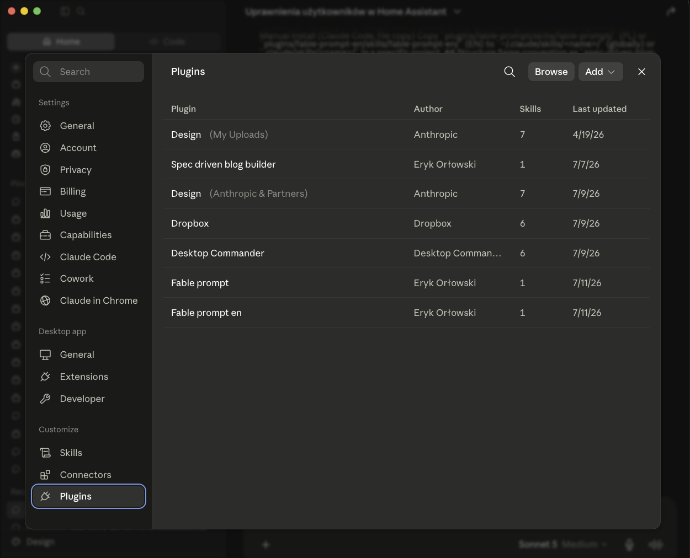
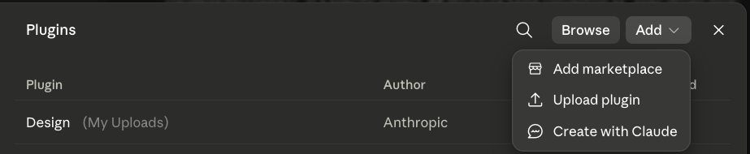
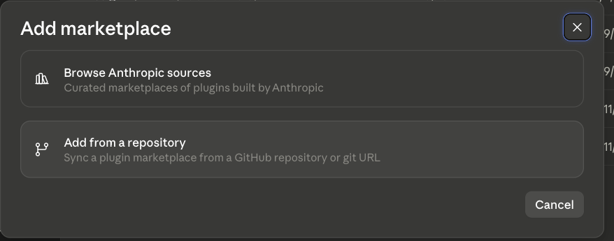
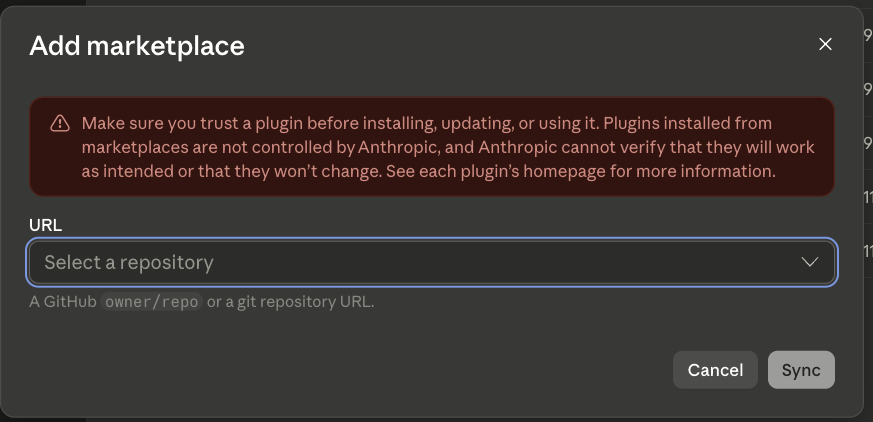
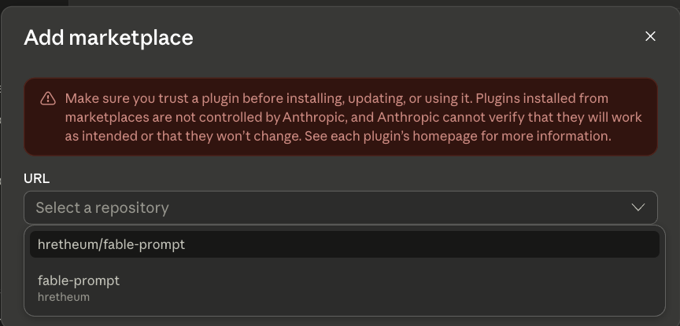

# fable-prompt

## Why even bother

Fable 5 isn't a chat model you fire off quick questions to — it's priced and built for whole,
multi-day jobs ($10/M input, $50/M output tokens), and treats a task like an unsupervised
contractor would: give it a vague ask and it'll happily burn a lot of tokens producing something
plausible-looking instead of what you actually needed. If you're feeding it prompts written for a
chat model, or don't have a repeatable answer to "when do I even reach for this," you're not
saving time — you're just spending more per mistake.

This skill exists because "prompt engineering" (clever, compact, safe questions) is the wrong
mental model for Fable 5. What works is "detailed task imagination" — specifying the entire job
across 9 fields before the model ever runs — and this skill walks you through exactly that, one
question at a time, so you can't accidentally skip the part that keeps the run cheap and the
output trustworthy.

**Read [`docs/why-fable.md`](./docs/why-fable.md) (PL) before your first run** — it distills the
Anthropic Fable 5 manuals into when to use it, when not to, and what this skill does at each
step, so you don't have to read three separate documents every time.

Interactively builds a validated prompt in Whole-Job Handoff format for Claude Fable 5 — asks
questions across the 9 spec fields, explains the consequences of each choice, audits the result, and
saves a clean `.md` file ready to hand off to Fable 5.

Available in two variants, in one marketplace:

| Variant | Plugin name | Command | Language |
|---|---|---|---|
| Polish (canonical) | `fable-prompt` | `/fable-prompt` | PL |
| English | `fable-prompt-en` | `/fable-prompt-en` | EN |

## What this is

This is a **Claude Skill** shipped as a **plugin** via the `hretheum-skills` marketplace — the same
mechanism as `spec-driven-blog-builder`. As of Claude Code 2.1.101, the `skills/<name>/SKILL.md`
format enables both explicit invocation (`/fable-prompt` or `/fable-prompt-en`) and autonomous
invocation by Claude when it recognizes the context from the skill's description.

## Install in Claude Code

```
/plugin marketplace add hretheum/fable-prompt
/plugin install fable-prompt@hretheum-skills
```

For the English variant:

```
/plugin install fable-prompt-en@hretheum-skills
```

## Install in Claude Desktop

Plugins from a GitHub marketplace can be installed directly in Claude Desktop (chat and Cowork) —
no terminal needed. Skills bundled in a plugin work the same in chat as in Cowork; this plugin has
no hooks or sub-agents, so there's no functionality difference between the two.

1. Open **Settings**, then under the **Customize** section click **Plugins**.

   

2. Click the **"Add"** button (top right), then **"Add marketplace"** from the dropdown.

   

3. In the **"Add marketplace"** dialog, choose **"Add from a repository"** (not "Browse Anthropic
   sources" — that's Anthropic's own curated marketplaces).

   

4. In the URL field, type `hretheum/fable-prompt` (it'll autocomplete) and click **Sync**.

   
   

5. Both `fable-prompt` (PL) and `fable-prompt-en` (EN) appear in the Plugins list. Click **Install**
   on the variant you want.

6. Start a new conversation — the skill activates automatically when it recognizes the context
   (or invoke it explicitly by describing what you want: "build me a prompt for Fable 5").

### Manual install (no GitHub, single account only)

If you'd rather not add a marketplace: **Customize → Skills → "+" → "Create skill" → Upload**, then
upload a ZIP of just the skill folder (not the whole repo) — e.g. zip the contents of
`plugins/fable-prompt/skills/fable-prompt/` so the ZIP's root contains `SKILL.md` directly. This
installs to one account only and won't get marketplace updates.

## Manual install (Claude Code, file copy)

Copy `plugins/fable-prompt/skills/fable-prompt/` (PL) or
`plugins/fable-prompt-en/skills/fable-prompt-en/` (EN) to `~/.claude/skills/<name>/` (globally) or
`.claude/skills/<name>/` in a specific project.

## Structure

Same convention as `spec-driven-blog-builder`: `.claude-plugin/marketplace.json` at repo root, one
subdirectory per plugin under `plugins/`, each with its own `.claude-plugin/plugin.json` +
`skills/<name>/` (`SKILL.md` + `assets/` + `references/`).
